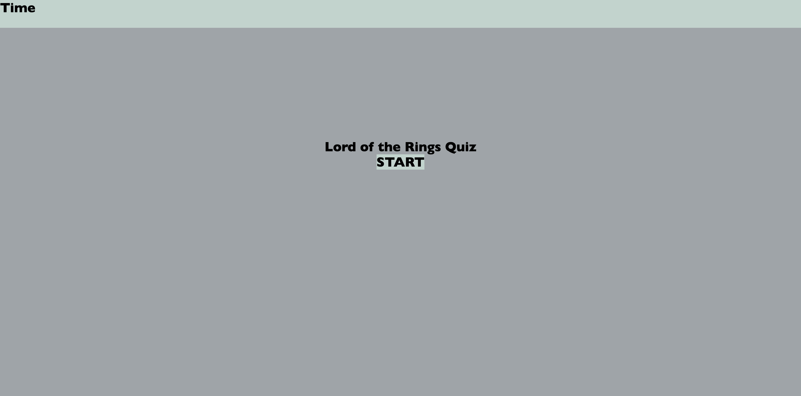
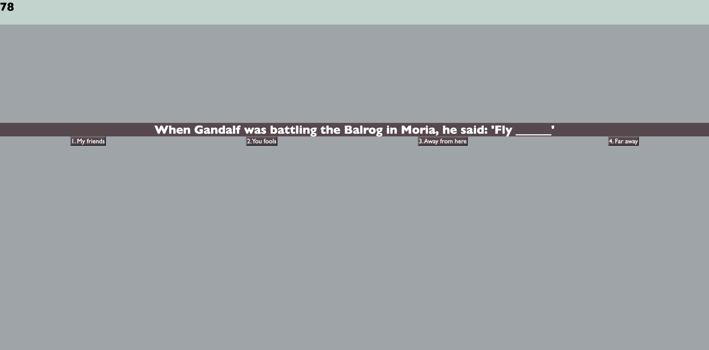
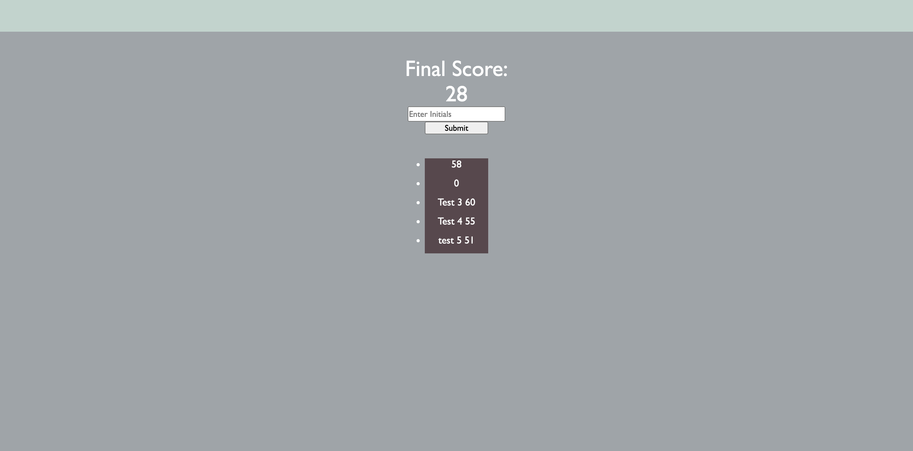

# Lord of the Rings Quiz

## Description
* This project is a quiz on Lord of the Rings (LOTR) trivia! It is meant to challenge the user on some of the more niche information from the LOTR canon.

## What I Learned
* I learned that there are some key methods that can only be executed on strings, and likewise with ingeters. This was an enormous pain point on this project.
* I also learned that it's easier to create an element in HTML and switch it between visible/invisible than it is to create/delete elements with JavaScript. 

## How To

* To use this application, simply load the page, and click the start button. 
* Once started, you will be timed in the top left corner of the screen.
* Each time you answer incorrectly, your time is reduced by 10 seconds. Your final time at the end of the quiz is your score.
* You can enter your initials and save your score afterwards. You will also be shown a list of previous scores if there are any saved in local storage.
* To play again, simply reload the page.

## Tech
* JavaScript
* CSS
* HTML

## Credits
* Code by Nicholas Jeffs. 
* Project outline by Columbia Coding Bootcamp

